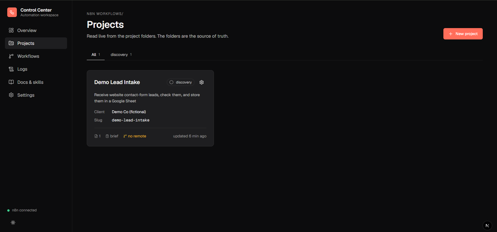
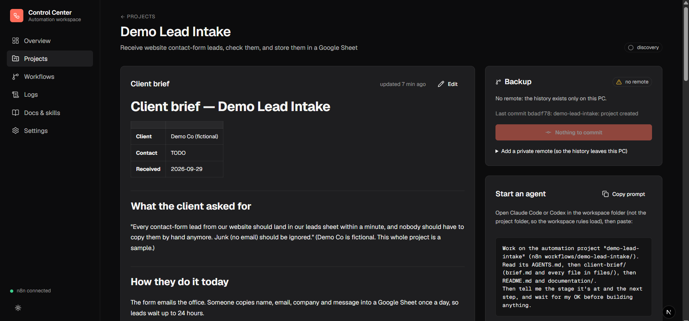
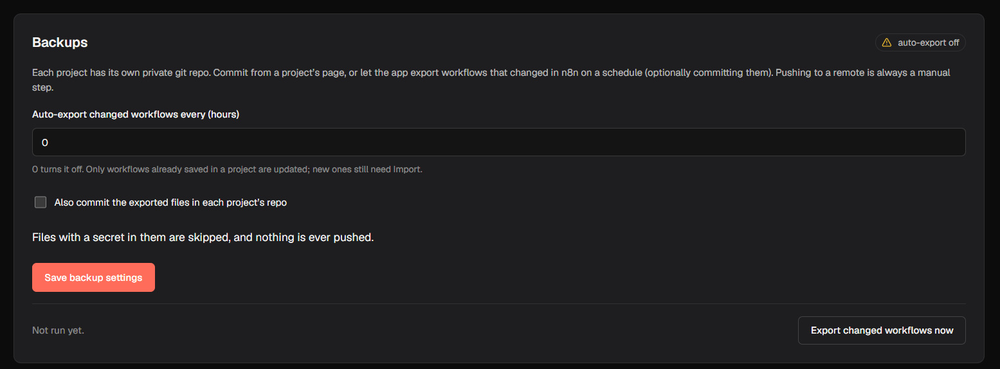
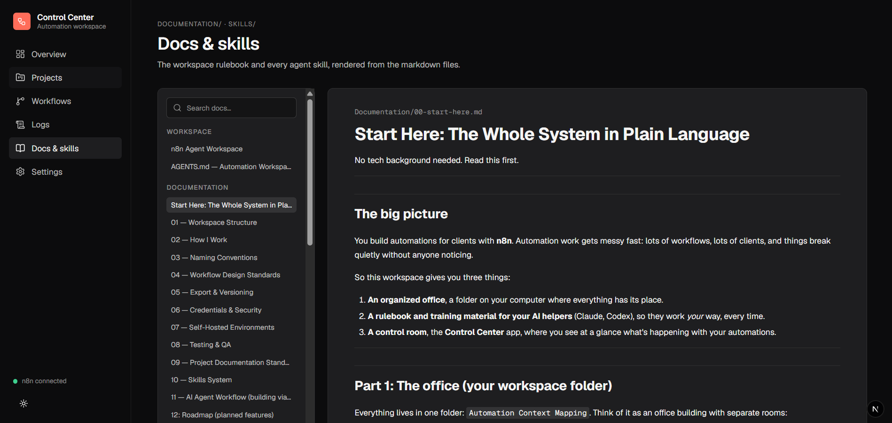

# n8n Agent Workspace

A ready-made workspace for building **n8n automations for clients with AI coding agents**
(Claude Code, Codex, Cursor). The agent follows your rules, uses curated n8n skills, and can't
publish or push without your OK. Every workflow is backed up, documented and versioned, and a local
dashboard shows what's running, what broke, and what isn't backed up yet.

## What you get

| | |
|---|---|
| **Rules your agent follows** | `AGENTS.md` + `Documentation/`: spec before build, sized before designing, numbered canvas sections, error handling, export after every change. A light path for small jobs |
| **Curated n8n skills** | The official n8n-io skill pack for the **official instance-level n8n MCP**, plus workspace skills for sizing, canvas sections, export, audit and handover (`Skills/INDEX.md`) |
| **Guardrails (Claude Code)** | Hooks that force your confirmation before publishing, archiving or production runs, and send the agent back when it changed a workflow but didn't export it |
| **One folder per client project** | Brief, specs, architecture, decisions, CHANGELOG, test evidence and the workflow JSON, each in its **own private git repo**. Client work never enters this public repo |
| **Safe exports** | One sanitizer (`sanitize-core.mjs`, tested) strips test data and instance state and refuses workflows with a secret typed into a node. Used by the app, the agents and commits |
| **Control Center** | A local dashboard: n8n executions from several instances, an event inbox, import / **restore to n8n**, publish, per-project **git backup** status and a Commit button, scheduled auto-export, a 30-day project trash |
| **Failure alerts** | A shared n8n workflow that emails and Telegrams you when anything fails, with a 15-minute cooldown and summaries, so alerts don't depend on your PC being on |

### Screenshots

Taken with the fictional demo project (`node scripts/setup.mjs --demo`).

| Projects, with backup state | A project: brief, workflows, Backup card |
|---|---|
|  |  |
| **Settings → Backups** | **Docs & skills, rendered in the app** |
|  |  |

### Agent support

| | Claude Code | Codex / Cursor / others |
|---|---|---|
| Rules (`AGENTS.md`) and skills (`Skills/`) | ✓ | ✓ |
| Hooks: forced confirmations, export check, session context | ✓ | — (they follow the checklist in `AGENTS.md`) |

```
n8n-agent-workspace/
├── AGENTS.md            ← rules every AI agent follows (CLAUDE.md just points here)
├── Documentation/       ← how we work: standards for ALL projects
├── Skills/              ← agent skills: vendored (official/community) + our own custom ones
├── n8n workflows/       ← one folder per automation project (+ _template/)
│   └── <project>/
│       ├── workflows/       importable n8n JSON
│       ├── website/         optional web app
│       └── documentation/   project docs
├── examples/            ← demo-lead-intake: a fictional sample project
├── app/                 ← Control Center: local dashboard (Next.js + SQLite)
└── scripts/             ← new-project.mjs, init-project-repo.mjs, link-skills.mjs,
                           control-center.mjs (+ .ps1 on Windows), hooks/ (Claude Code guardrails)
```

## Requirements

- **Windows, macOS or Linux.** The scripts are Node (`scripts/*.mjs`); the `.ps1` files are Windows
  shortcuts to the same scripts
- **Node.js 22.18+** (Claude Code hooks, scripts, Control Center) and **git**
- A **self-hosted n8n** with the official **instance-level MCP** enabled (Settings → MCP), connected
  to your agent
- An AI coding agent: **Claude Code** (rules + skills + hooks), or Codex / Cursor (rules + skills)

## Quick start

**First time on a machine** (Windows, macOS or Linux):

```bash
node scripts/setup.mjs --demo
```

It checks Node and git, links the skills for Claude Code, Codex and Cursor, creates your local
`AGENTS.local.md` and `app/.env.local` (with a fresh inbox token), and copies a fictional demo
project into `n8n workflows/`. Add `--app` to also install the Control Center. Then fill in
`AGENTS.local.md` (your name, credential names, n8n URLs). Agents read it, and it never leaves your PC.

**Claude Code:** open the session in this folder and accept the project hooks when asked. They
inject the rules at session start, force a confirmation before publishing or production runs, and
remind the agent to export workflows it changed. If you also have n8n skills installed globally
(`~/.claude/skills`), disable duplicates of the ones in `Skills/`. Two routers confuse the agent.

The `Documentation/` files contain `TODO(owner)` markers (rates, instances, backup schedule).
They're yours to fill in; agents are told never to invent them.

**New automation project:**

```powershell
node scripts/new-project.mjs --name acme-lead-intake --client "Acme Co"
```

Or just ask your agent to *"start a new automation project for …"*. The `new-automation-project`
skill handles it.

**Control Center (local dashboard):**

```powershell
copy app\.env.example app\.env.local      # then fill in the values
node scripts/control-center.mjs install
```

It then runs in the background from every login at http://127.0.0.1:3100 (Windows: a login task;
macOS: a launchd agent; Linux: a systemd user service). Install it as an app
from Chrome/Edge for its own window. After code changes: `node scripts/control-center.mjs update`.
See [app/README.md](app/README.md).

### Updating an existing installation

The Control Center now stages updates in separate release directories, runs its checks, and
backs up the database and local credentials before activation. Failed release health checks
trigger an application rollback; the database is not automatically rolled back. State snapshots
are private, unencrypted files under `app/data/snapshots/`; protect them like your credentials.

For the first transition from the old Windows launcher, follow the
[remediation and migration guide](Documentation/audits/2026-09-29-remediation-handoff.md).
The updater intentionally refuses to stop an unidentified legacy server.

- Existing workflow exports need an explicit binding to their source installation before automatic
  export can update them. CLI exports require `--installation`; a workflow ID alone is insufficient.
- Restore requires verified credential and workflow references plus a fresh preview. Restoring
  does not publish a workflow, but updating an already published target still affects that target.
- New brief/evidence attachments must be sanitized UTF-8 text. Binary files are rejected;
  existing attachments remain available. Secret detection is a safeguard, not a guarantee.
- Monitoring reports observed execution history and any sync gaps. Log filters no longer remove
  the minimal facts used for health and success rates.

See the guide for binding commands, restore mappings, recovery instructions, and validation limits.

## What stays local

The repo is public, so these are gitignored and never pushed:

- `n8n workflows/<project>/` (all client projects) and `n8n workflows/REGISTRY.md`
- `AGENTS.local.md` (your personal facts)
- `app/.env.local` and `app/data/` (the Control Center's database, logs, and tokens)

Instead, each project gets its **own private git repo** (`n8n workflows/<project>/.git`, created
by `new-project.mjs`; add one to an existing project with `node scripts/init-project-repo.mjs --name <slug>`).
It's local until you add a remote, and a remote must be a **private** repo.

## Where to read next

| If you want to… | Read |
|---|---|
| Understand the whole system | [Documentation/README.md](Documentation/README.md) |
| Know the rules agents follow | [AGENTS.md](AGENTS.md) |
| See which skill to use when | [Skills/INDEX.md](Skills/INDEX.md) |
| See all projects and their status | `n8n workflows/REGISTRY.md` (local-only), or the Control Center |

## Contributing and security

See [CONTRIBUTING.md](CONTRIBUTING.md) (setup, checks, where changes go) and
[SECURITY.md](SECURITY.md) (what the local app exposes, how to report a problem privately).

## License

[MIT](LICENSE) for this workspace. Vendored skills keep their own licenses (Apache-2.0 for the
official n8n-io skills, MIT for the community pack). See [Skills/_licenses/](Skills/_licenses/).
