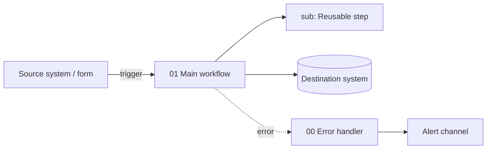

# Architecture — Demo Lead Intake

## Overview diagram

## Workflows

| # | Name | Trigger | Calls | Called by |
|---|---|---|---|---|
| 00 | Handle workflow errors | Error Trigger | — | all (error workflow setting) |
| 01 | | | | |

## External systems

| System | Direction (in/out) | Auth / credential | Notes |
|---|---|---|---|
| | | | |

## State and storage

| Store | What | Retention |
|---|---|---|
| Data Table `demo_lead_intake_…` | | |

## Data flow and PII

<!-- Which personal data passes through, where it is stored, and for how long. -->

## Known limits and risks

- 
